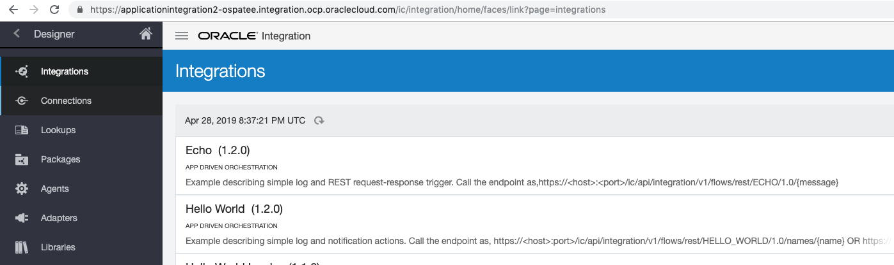
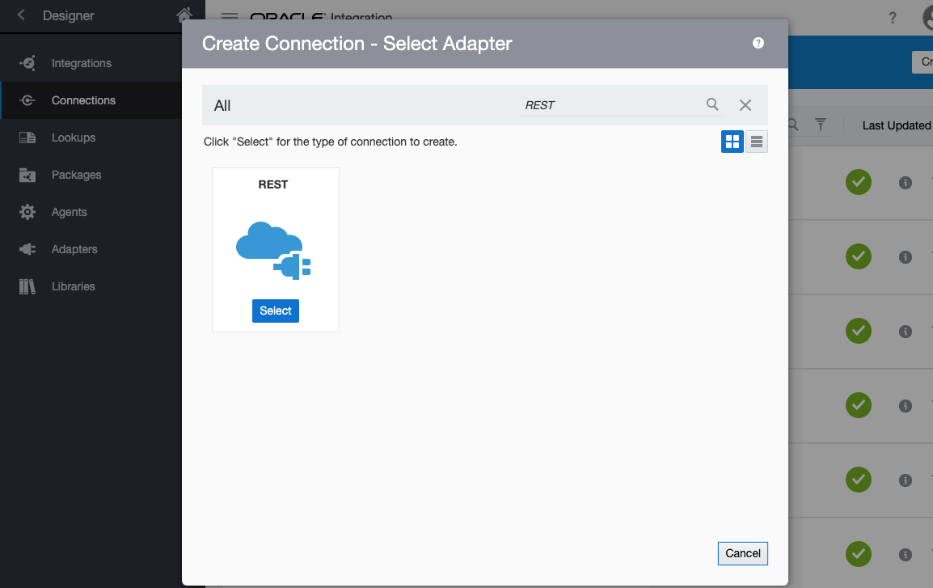
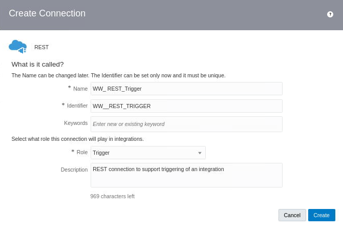
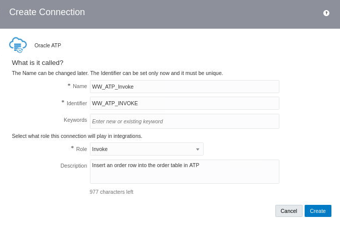
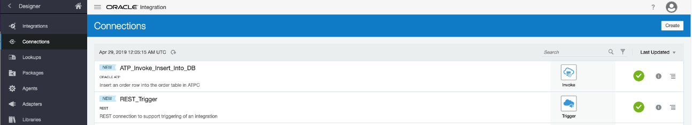

# Create Connections

## Introduction

Walkthrough demo
[](https://videohub.oracle.com/media/Integration+Lab+-+Create+Connections/1_hplssoqu)

**Estimated Time**: 30 minutes

### Objectives
* Create an Application
* Publish tasks to Application
* Creating a Pipeline which calls the published tasks
* Creating a Pipeline Task
* Publish the Pipeline Task

## Task 1: Create a Connection

1. Click on the ****Integrations**** option to access the ****Oracle Integration: Integrations**** page. If you can’t see the menu options at the left, click the hamburger menu icon in the upper-left to reveal the menu.

We will create two connections you’ll use in the integration you'll build in a moment. One connection will enable a REST client to access the integration. The other connection will allow your integration to communicate with the ATP database.

2.  On the Integration page, click the ****Connections**** menu option at the left:



****Create a REST Connection****

Create a REST Trigger connection that will allow your integration to be initiated:

3.  Click the ****Create**** button in the upper-right corner of the ****Connections**** page.

4.  The ****Create Connection – Select Adapter**** dialog appears so you can choose the prebuilt adapter that you want to be the basis for your new connection. Oracle has many prebuilt adapters that shield the user from all the details on how to interact with many backend services. Prebuilt adapters save time and allow less-technical people to be successful building integrations. 

5.  In the ****Search**** field, enter: ****REST**** and press ****Return****. The REST adapter appears. Click the ****Select**** button for the ****REST**** adapter.



6.  The ****Create New Connection**** dialog appears so you can provide details about how this connection will be used in your integration.

7.  Fill in the fields:

      - Name: 
      ```
      REST_Trigger
      ```
    
      - Role: ****Select Trigger**** from the dropdown menu to indicate that this connection will trigger the first step in a series of steps in an integration.
    
      - Description:
      ```
      REST connection to support triggering of an integration
      ```



  - Click the ****Create**** button.
  
  - For ****Security****, choose ****OAuth 2.0 Or Basic Authentication****. 


8. Click the ****Test**** button in the upper-right corner and look for the “****Connection REST\_Trigger was tested successfully****” message in the upper-left corner to indicate that you have created a valid connection.

9. Note the blue icon in the upper-right indicates that your connection has been **100%** defined.

10. Click the ****Save**** button in the upper-right to save your new connection.

11. Click the **<** button in the upper-left to return to the ****Connections**** page. Notice that your new connection appears in the ****Connections**** list.

****Create an ATP Connection****

Let's create the second connection we'll need for our integration. That will be an ATP Invoke connection that will allow your integration to invoke a backend service, which is the ATP Database.

12. Click the ****Create**** button in the upper-right corner of the ****Connections**** page. The ****Create Connection – Select Adapter**** dialog appears so you can choose the prebuilt adapter you want to be the basis for your new connection.

13. In the ****Search**** field, enter: ****ATP**** and press ****Return****.

14. The ****Oracle ATP**** adapter appears. Click on its ****Select**** button.

15.  The Create New Connection dialog appears. Fill in the fields:

      - Name: 
      ```
      ATP_Invoke_Insert_Into_DB
      ```
    
      - In the Role field, select ****Invoke**** from the dropdown menu to indicate that this connection will not trigger the integration, but instead, it will be invoked by it.
    
      - Description:
      ```
      Insert an order row into the order table in ATP
      ```



  - Click the ****Create**** button.
  

16. Establish the Connection Properties for this new ATP invoke connection:
    
      - In ****Connection Properties**** area:
    
      - For Service Name, enter: ```dbappintshared_high``` (This gives us the best performance.)
    
17. Establish the Security settings: Perform the necessary configuration:
    
      - For the ****Wallet**** fields, just to recall that you have downloaded the wallet zip file. We can supply the connection with the database sign in details (the wallet) you established in that section.
        
          - Click on the ****Upload**** check box to begin uploading your wallet file.  
        
          - Select the ****Choose File**** button and the ****Upload File**** dialog appears.
        
          - At the top of the dialog, it shows your name and a home button. Click on ****Downloads**** folder and select ****your Wallet zip file**** that you downloaded into Luna's File Manager earlier.
        
          - Select your ****Wallet zip file**** and click the ****Open**** button.
        
          - Click the ****Upload**** button on the ****Upload File**** dialog to upload your database access credentials into your new connection.
    
      - For the ****Wallet Password**** , enter 
      ```
      DBWelcome12345
      ```
    
      - For the Database Service Username, enter: 
      ```
      atpc_user
      ```
    
      - For the Database Service Password, enter 
      ```
      DBWelcome12345
      ```

- Click the ****Test**** button in the upper-right and watch for the “****Connection ATP\_Invoke\_Insert\_Into\_DB was tested successfully****” message to appear in the upper-left corner.

18. Click the ****Save**** button in the upper-right corner to save your new connection.

19. Click the ****<**** button in the upper-left corner to return to the ****Connections**** page.

20. Notice that your two new connections appear on the ****Connections**** page:




## Acknowledgements

* **Author** - 
* **Contributors** - 
* **Last Updated By/Date** - 
