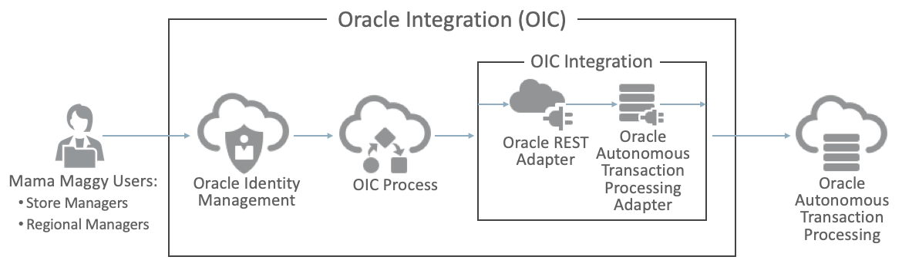

# Create Your Oracle Integration (OIC) Instance

## Introduction

NEED TO DO NoVNC

**Estimated Time**: 20 minutes

### Objectives
* Create access policies for OCI Data Integration using Policy Builder UI in Oracle Cloud Infrastructure
* Create a Workspace for Data Integration resources

## Task 1: Creating an Integration

In this lab, you use the Integration component of Oracle Integration (OIC) to build an application integration which will be used in another lab ****Oracle Integration - Process Automation**** to connect a process automation application to an Autonomous Transaction Processing (ATP) database creating a new order based on an approved order request.

****Key Tasks to Complete****

  - Create two connections that leverage prebuilt adapters. Connections let our integration reach outside Oracle Integration to interact with calling clients and back-end services. The first connection allows an integration to be triggered by a REST request from a process application built by OIC Process. The second connection initiates an insert operation on a table in the ATP database. 

  - Use the two connections to build a new integration that accepts order data via a REST POST and creates a new order row in the ORDERS table in the ATP database.

Let's revisit the technical architecture, displayed below, to get your bearings. Focus on the **OIC Integration** area. In the integration we are about to build, we will create two connections utilizing REST and ATP adapters and we will perform data mappings to make sure the right data is available to them. Ultimately, a new order will be added to **Oracle Autonomous Transaction Processing**:

   **Congratulations!**  Now you have your Oracle Integration (OIC) Instance

## Learn More

* [Workspaces in OCI Data Integration](https://docs.oracle.com/en-us/iaas/data-integration/using/workspaces.htm)
* [Policies in OCI Data Integration](https://docs.oracle.com/en-us/iaas/data-integration/using/policies.htm)

## Acknowledgements

* **Author** - Theodora Cristea
* **Contributors** -  Aditya Duvuri, Rohit Saha
* **Last Updated By/Date** - Theodora Cristea, July 2021
