# Create a New Integration

## Introduction

Watch this short video:
[](https://videohub.oracle.com/media/Integration+Lab+-+Create+Integration/1_po6615q0)

**Estimated Time**: 30 minutes

### Objectives


## Task 1: Create a Integration

With our two connections in place, we can now create our integration.

1. Click the ****Integrations**** menu option at the left-side menu:

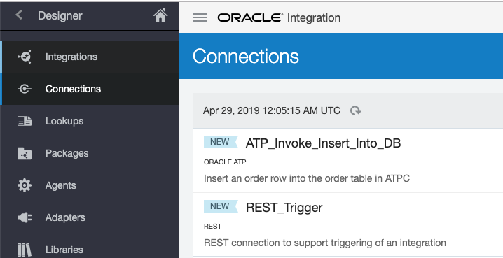

2. The ****Integrations**** page appears. Click on the ****Create**** button in the upper-right corner.

3. The ****Integration Style**** dialog appears showing the various templates used to create a new integration. These styles speed integration development and do a lot of pre-configuration for you.

4. Read the descriptions for each of the styles so you can appreciate the style support.

5. Select the ****App Driven Orchestration**** style by clicking on its ****Select**** button. Our integration will be ****triggered by an Application**** you will develop in ****Lab - Oracle Integration (Process Automation)****.

6. The ****Create New Integration**** dialog appears. Fill in the fields:
    
      - In the ****Name**** field, enter: 
      ```
      Create New Order
      ```
    
      - In the ****Description**** field, enter: 
      ```
      Accept a REST POST call and create a new order in the ATP database
      ```

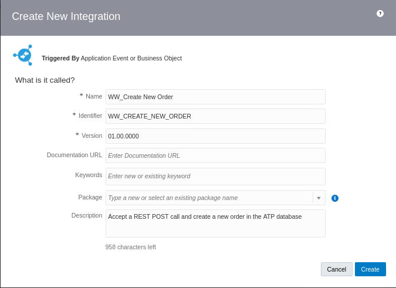

  - Click the ****Create**** button to display the ****Integration Editor****.


7. Notice the beginnings of the new integration in the integration editor canvas. This is where you will visually define your integration using easy-to-use drag and drop features:

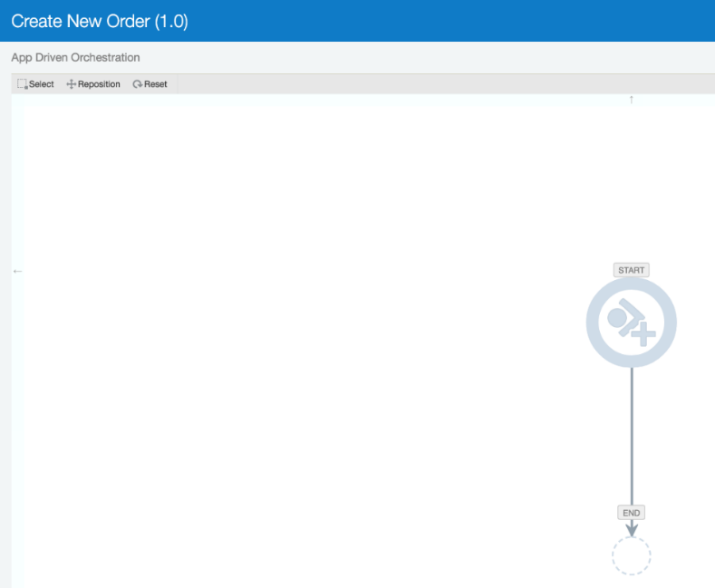

8. Click the ****Save**** button in the upper-right corner.

## Task 2: Define the Integration

Let's start adding elements to the integration editor canvas to define your integration.

****Add a Trigger****

1. Find the ****Triggers**** icon at the extreme right-side of the window and ****click on it**** so you can use the REST\_Trigger connection that you just built.

2. The available trigger connections appear:

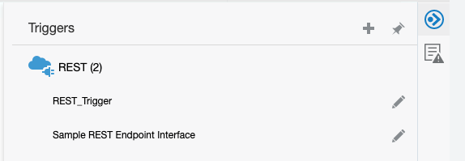

3. ****Drag your REST\_Trigger**** connection and drop it into the ****Start**** element since it will trigger the integration:


4. The Configure REST Endpoint dialog appears. An endpoint indicates how you access the resource and what you want to do with it. Fill in 
    
      - What do you want to call your endpoint? Enter: 
      ```
      Accept_Order_Data_Endpoint
      ```
    
      - What does this endpoint do? Enter: 
      ```
      Accept a REST POST of new order data
      ```
    
      - Click ****Next**** in the upper-right corner.
    
      - What is the endpoint’s relative resource URI? Enter: 
      ```
      /order
      ```
    
      - What action do you want to perform on the endpoint? Select ****POST**** from the dropdown menu. POST is a standard method to use to send XML data to a server in the request body of an HTTP request.
    
      - Select any options that you want to configure: Check on ****Configure a request payload for this endpoint.****
    
      - Click ****Next**** in the upper-right corner.
    
      - Skip over the ****Attachment Processing Options****.
    
      - Find the ****Select the request payload format**** area so you can define the structure of payload data that will come into the integration with this trigger.
    
      - Make sure that XML Schema (the default) is selected from the dropdown menu.
    
      - At the ****Schema Location**** field, we need a xsd file to provide a data definition as we are configuring a REST endpoint for our integration. We will use the XSD format to define the data. “XSD” stands for XML Schema Definition. It is a standard way to describe the structure of an XML document. Our request payload for our endpoint will be formatted in XML. 

          - Click the ****Choose File**** button to display a file chooser dialog:
        
          - Navigate to ****Download**** directory and choose the ****RESTEndpointRequestPayload.xsd**** file you downloaded earlier to Luna's File Manager.
        
          - Notice in the ****Element**** field that the tooling has read the file and has selected ****Order****. That’s the only element defined in your XSD. ****NOTE:**** If the tooling has trouble validating your xsd file, you may need to edit it and clean up some formatting. Sometimes, copying and pasting drags along some hidden characters at the end of lines.
        
          - In the area labeled ****Select the media type which you want the endpoint to receive****, select ****JSON****. “JSON” stands for “JavaScript Object Notation.” It is a lightweight data interchange format that is easy for humans to read and write. Later, in Lab 2, you’ll see that this request payload will be supplied by a web form and web forms deal in JSON data structures.
    
      - Click ****Next**** in the upper-right corner to display the ****Summary**** dialog so you can review your settings for this request endpoint.
    
      - Click the left arrow on the ****Endpoint Summary**** field to see that you have defined an endpoint that will accept a ****JSON payload**** via a ****POST**** to a REST service URI called ****/order****:

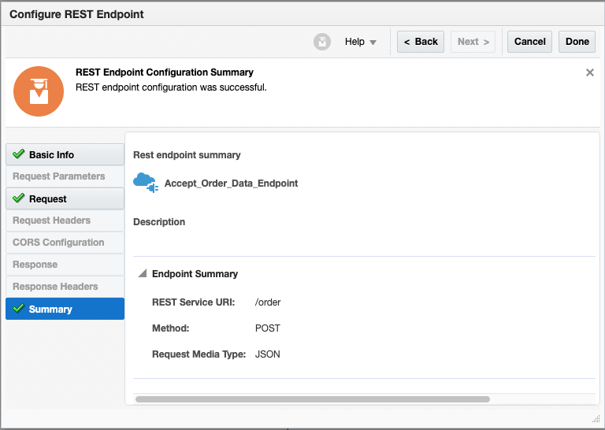

  - Click ****Done**** in the in the upper-right corner to close the Configure REST Endpoint dialog.


5. The integration editor canvas now shows your REST trigger at the top of the diagram:

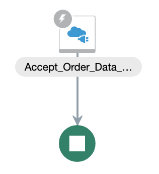

6. Click ****Save**** in the upper-right corner.

****Add an Invoke****

7. Find the ****Invokes**** icon at the extreme right-side of the window and click on it so we can add your ****ATP\_Invoke\_Insert\_Into\_DB**** connection to the integration editor canvas. The available invoke connections appear:

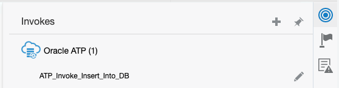


8. Drag your ****ATP\_Invoke\_Insert\_Into\_DB**** connection and drop it onto the ****plus icon**** that appears on the diagram right below your REST trigger element as you drag.

9. The Oracle Adapter Endpoint Configuration Wizard dialog appears. Fill in the fields:
    
      - What do you want to call your endpoint? Enter: 
      ```
      Insert_Order_Endpoint
      ```
    
      - What does this endpoint do? Enter: 
      ```
      Insert a new order into the ATP database
      ```
    
      - What operation do you want to perform? Select: ****Perform an Operation On a Table**** from the dropdown menu.
    
      - What operation do you want to perform on Table? Make sure that the ****Insert**** option is selected.
    
      - Click the ****Next**** button in the upper-right corner.
    
      - The wizard moves to the ****Define the Operation On Table**** step.  Make these selections in the fields:
        
          - Schema: Select: ****ATPC\_USER**** from the dropdown menu.
        
          - Table Type: ****Make sure that TABLE is selected****
        
          - For Table Name, click the ****Search**** button.
        
          - Move the ****ORDERS**** table to the ****Selected**** column in the table that appears, by selecting it and clicking the “****\>****” symbol.
        
          - Click the ****Import Tables**** button at the bottom to display the ****Select the parent database table**** step. Make sure that ****ORDERS**** is selected and click ****Next**** in the upper-right corner.
        
          - The wizard displays the ****Summary**** step page. See that you have configured your ATP connection to perform an ****Insert**** database operation on the ****ORDERS**** table:

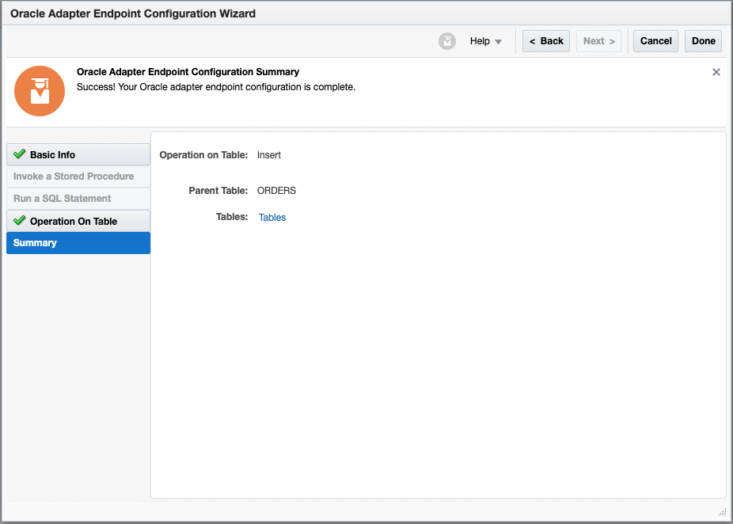

  - Click ****Done**** in the in the upper-right corner to close the Oracle Adapter Endpoint Configuration Wizard dialog.


10. The integration canvas now shows your ATP invoke at the bottom of the diagram. Notice that a ****Map to Insert\_Order**** element has been automatically inserted ahead of it so you can map incoming data from your REST trigger to your ATP invoke:

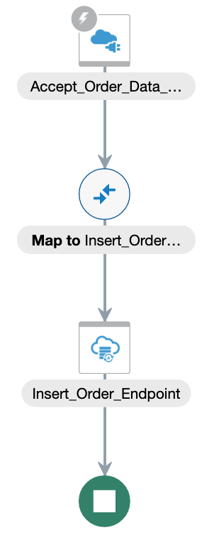

11. Click ****Save**** in the upper-right corner.

## Task 3: Map Data

1. Let’s use the data mapper to indicate how incoming order data from the REST POST request is to be passed to the outbound invocation of the ATP database:
    
      - Click on the ****Map to Insert\_Order**** element in the canvas.
    
      - Select the ****Edit**** (pencil) icon that pops up to display the data mapper.
    
      - Expand the ****Order**** fields to display the five fields each at the left and right columns.
      
      - Map each of the five fields from the source at the left (the inbound REST call) to the corresponding files in the target at the right (the outbound ATP invocation):
        
          - Click a source field (like ****orderID****) at the left and drag it to the corresponding target field (like ****orderID****) at the right to highlight those you want to map.
        
          - A green line appears temporarily, but you are looking for both fields to show a green check mark icon to indicate that the mapping is in place.
            
              **NOTE:** If you make a mistake during mapping, delete a mapping by:
                
              - Right click the ****field name**** on the target side.
              
              - Select the ****Delete Mapping**** option in the popup menu.
                
              - Notice that the mapping is gone from the data mapper.
                
              - Perform the desired mapping.
    
      - Continue mapping until all five fields are mapped:

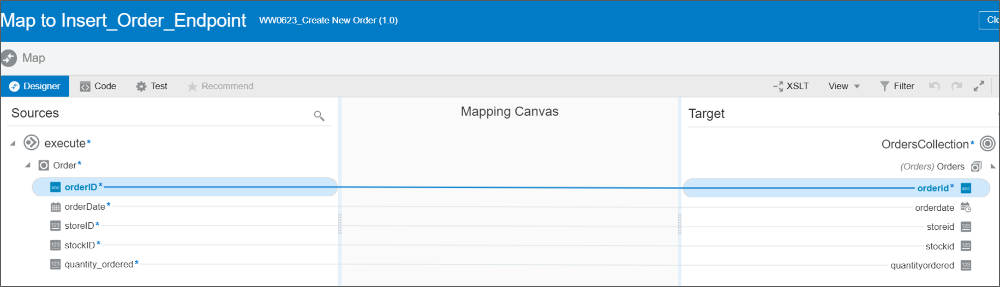

2. Click the ****Validate**** button in the upper-right corner of the mapper and look for the “Mapping is valid and ready to use” message in the upper-left corner.

3. Click the ****Close**** button in the upper-right corner to close the data mapper. The modeling canvas window redisplays.


4. Click ****Save**** in the upper-right corner of the editing canvas window.

## Task 4: Configure Integration Tracking

1. Notice the ****red 1 icon**** at the top right of the canvas indicating that we aren’t done yet. Let’s explore the error:
    
      - Click on the ****red 1 icon**** to display the ****Errors**** panel.
    
      - Carefully hover the mouse cursor over the Errors icon to learn the details:

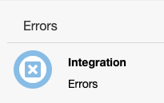


  You learn that we haven’t supplied the fields we want to display in the tracking facility. OIC Tracking can help us troubleshoot our integration when something goes wrong at runtime, so the tooling makes tracking a mandatory requirement. Now, we need to specify what data fields we want to use to track the execution of an integration. We can specify up to three pieces of data to include in the tracking logs. The orderID field seems like important information to add to the tracking information, so we’ll add it.

2. Click the ****hamburger menu**** (highlighted below) right below the Save button:

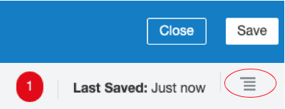


3. Select the ****Tracking**** option in the popup menu to display the ****Business Identifiers For Tracking**** dialog.

4. Click the ****orderID**** and then the right arrow to populate the ****Tracking Field**** cell in the first row of the tracking table at the right. If the right arrow doesn't work, try drag-and-drop orderID into first row 

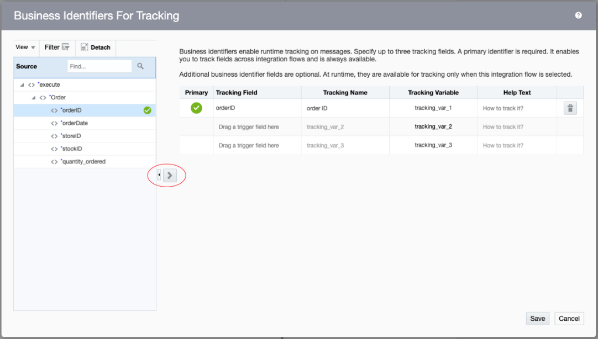

5. Click ****Save**** in the lower-right corner to record your selection and to close the dialog.

6. Click ****Save**** in the upper-right corner of the editing canvas page.

7. Our Create New Order integration is now complete:

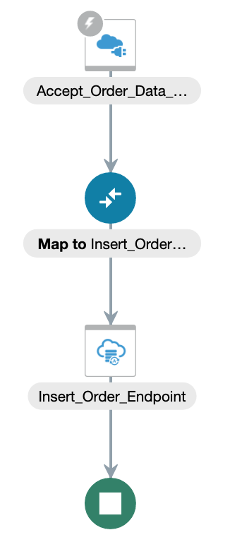


8. Click ****Close**** in the upper-right corner to exit the integration editor canvas window. The Integrations page redisplays and shows your new ****Create New Order**** integration at the top.

## Task 5: Activate an Integration

Walkthrough demo video
[](https://videohub.oracle.com/media/Integration+Lab+-+Activate+Integration/1_idfzi21b)

Our last step in this lab is to activate our integration.

1. At the right of your integration, there are couple of circle buttons.  Click on the one that shows ****Activate**** when it is hovered (it looks like an on/off button). The ****Activate Integration**** dialog appears.


 
2. Select these options in the Activate Integration dialog that appears:
    
      - Enable tracing: Click the check box to ****On****
    
      - Include payload: Click the check box to ****On****

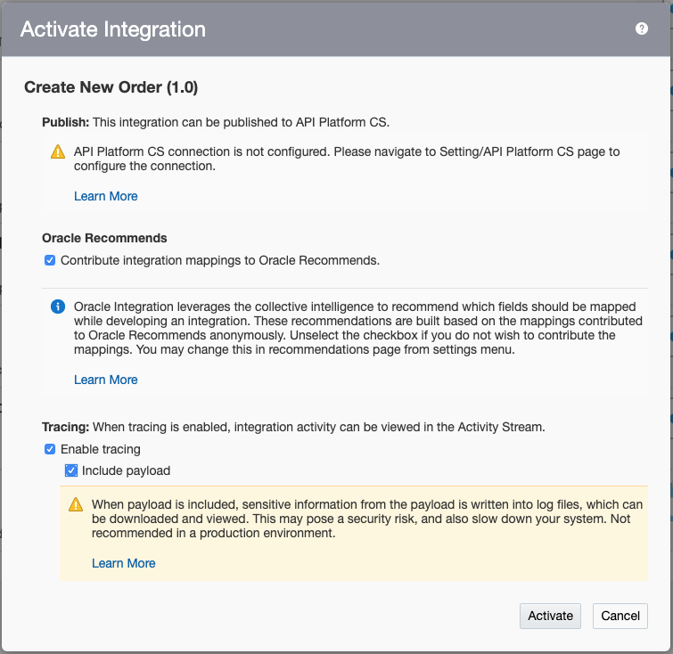


  - Click the ****Activate**** button in the lower-right corner.


3. When the Activate Integration dialog closes, verify that the integration has been activated:
    
      - Refresh your browser window.
    
      - See that the ****Active**** status is shown meaning that your integration has been activated and is ready for use. Keep refreshing if the message doesn’t appear.

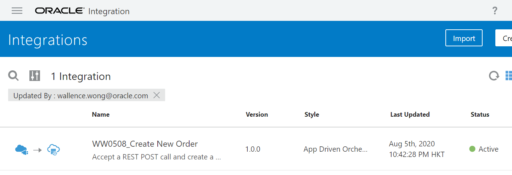


****Congratulations\!**** You have completed this OIC Integration lab.  You are also highly recommended to attempt another Oracle Integration lab namely ****Oracle Integration (Process Automation)**** where you’ll use the Business Process component of Oracle Integration to build a process automation application Mama Maggy’s store managers use to enter order requests and regional managers to approve/reject them. If the requests are approved, orders will be created in the ATP database using the integration that you have just built.  At the end, you will be able to see how your integration will work with the process application to solve Mama Maggy's challenges.


## Learn More


## Acknowledgements

* **Author** - 
* **Contributors** -  
* **Last Updated By/Date** - 
