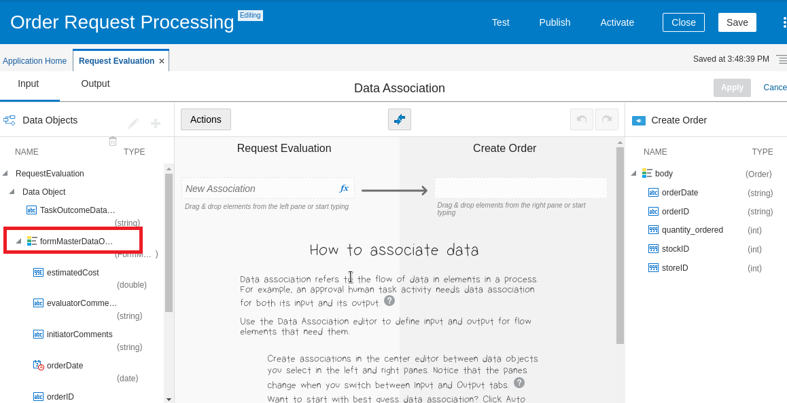

# Configuration

## Task 1: Implement the Submit Request Event

Let’s now condition the ****No**** branching flow at the ****Approved?**** exclusive gateway so that when a regional manager, working in the Approve Request activity, clicks the ****REJECT**** button for an order request, the request is routed to the ****Resubmit**** activity where the store manager can work on it and resubmit it.

****NOTE:**** The ****Output**** data association from the Approve Request activity included a mapping of the ****outcome****. The outcome is set by the regional manager clicking either the ****APPROVE**** or the ****REJECT**** button.


It is the value of the ****TaskOutcomeDataObject**** that we will check our condition to see if the order request should be routed along the ****No**** path to the ****Resubmit**** activity.
 
Let’s configure ****TaskOutcomeDataObject.****

1. Click on ****No**** above the ****Approved?**** exclusive gateway element:


2. Two icons popup in a menu, select the ****Edit (pencil) icon**** so we can specify the condition to evaluate for this ****No**** path through your model:


3. A panel appears at the bottom of the page where you can begin specifying the branching condition. Find the ****Edit**** (pencil) icon in the ****Condition**** field and click on it to display the ****Expression Editor**** dialog.

4. In the ****Expression Editor****, expand the ****RequestEvaluation**** hierarchy to display its data objects:


5. Select the ****TaskOutcomeDataObject**** and then click the ****Insert Into Expression**** button to add it to the expression area.

6. Then, finish the expression by entering: ****="REJECT"****

 ****NOTE:**** Make sure that the double quotes appear as ****straight**** (" ") rather than ****curly**** (“ ”). ****Curly**** double quotes will produce a validation error. Copy and pasting from above may be the best approach.


7. Click the ****OK**** button in the lower-right corner of the ****Expression Editor**** to close the dialog.

8. In the lower panel, find the ****Description**** field for the ****No**** branch and enter: 
```
Route processing to Resubmit for an order request that was rejected by the regional manager.
```
9. Click ****Save**** in the upper-right corner of the window.

## Task 2: Import and Configure a Pre-Built Integration

****Walkthrough Demo Video****
[](https://videohub.oracle.com/media/Import+Prebuilt+Integration+to+Process+Application/1_sgtru5ub)

There is one more task we need to perform to complete the process model.  We need to create an integration namely ****Create New Order**** in order for us to connect the order approval application to the backend system ATP database. We will then add a ****Create Order**** activity that calls our ****Create New Order**** integration. Here is how that ****Create Order**** activity ****should**** appear in the process model, so let's do it:


To simplify this lab, we have prepared a pre-built integration for you to add to your process workflow.  If you would like to learn to create a new integration with OIC from scratch, you are strongly recommended to attempt another lab namely ****Oracle Integration (Application Integration)**** which can be found in Luna or Oracle Help Center as well.  Let's now download our pre-built integration:

1. Click ****+**** at the top of Google Chrome browser to add a new tab.  Copy and paste the below link to the URL field to download the below file:

    - **WW0325_Create_New_Order_01.00.0000.iar** [](./files/WW0325_CREATE_NEW_ORDER_01.00.0000.iar)

2. Return to the OIC webpage by clicking the Integration tab at the Chrome browser.  Click the home icon at the top left corner to return to the OIC landing page. 

3. Click the ****Integrations**** option to access the ****Oracle Integration: Integrations**** page. If you can’t see the menu options at the left, click the hamburger menu icon in the upper-left to reveal the menu.

4. Click the ****Integrations**** option to come to this page and find the ****Import**** button at the top right corner.


5. Import Integration dialog box pops up.  Click ****Choose File**** button to upload the iar file you just downloaded.  It is located in the ****download**** directory.  Click ****Open**** to complete the upload.

6. Click ****Import and Configure****.  


7. The Configuration Editor appears and it shows there are two connections that have been pre-created for you in this integration.  One is REST_Trigger and the other one is ATP Invoke.  Now, we need to do some minor configurations before they can be used.


8. Let's start with REST_Trigger connection.  Mouse over this row and click the pencil icon.  Change the Security policy to ****OAuth 2.0 Or Basic Authentication****.  Then test it out by clicking ****Test**** button on the top right corner.  If successful, click ****Save****  and then click ****<**** at the left hand side to return to the Configuration Editor.

9. Now we configure ATP_Invoke connection.  Mouse over this row and click the pencil icon.  Scroll down the pane to the Security section to establish the security settings.  On the right, you will need to add credentials in order to access the ATP instance we prepared.  


10. You need to download the ATP wallet which contains the credentials.  Click ****+**** at the top of Google Chrome browser to add a new tab.  Copy and paste the below link to the URL field to download the below file:

    - **wallet_DBAPPINTSHARED** [](./files/wallet_DBAPPINTSHARED.zip)


    
11. Return to the ****Integration**** tab, then perform the necessary configuration:
    
      - For the ****Wallet**** fields, we can supply the connection with the database sign in details (the wallet) you established in that section.
        
          - Click ****on**** the ****Upload File**** check box to begin uploading your wallet file.  
        
          - Select the ****Choose File**** button and the ****Upload File**** dialog appears.
        
          - At the top of the dialog, it shows your name and a home button. Click on ****Downloads**** folder and select ****your Wallet zip file**** that you have just downloaded into Luna's Download folder earlier.
        
          - Select your ****Wallet zip file**** and click the ****Open**** button.
        
          - Click the ****Upload**** button on the ****Upload File**** dialog to upload your database access credentials into your new connection.
    
      - For the ****Wallet Password**** , enter
      ```
      DBWelcome12345
      ```
    
      - For the Database Service Username, enter: 
      ```
      atpc_user
      ```
    
      - For the Database Service Password, enter 
      ```
      DBWelcome12345
      ```

    - Click the ****Test**** button in the upper-right and watch for the “****Connection ATP\_Invoke\_Insert\_Into\_DB was tested successfully****” message to appear in the upper-left corner.

12. Click the ****Save**** button in the upper-right corner to save your new connection.

13. Click the ****<**** button in the upper-left corner to return to the Configuration Editor page.  You should now be able to find that both REST and ATP connections have ****Configured**** status. 

14. One more step in this section is to activate our integration. 


15. Mouse over the ****Create New Order integration**** row, click on the one that shows ****Activate**** when it is hovered (it looks like an on/off button). The ****Activate Integration**** dialog appears.


16. Check the below boxes in the Activate Integration dialog that appears:
    
      - Enable tracing to view integration activity
    
      - Include payload


  - Click the ****Activate**** button in the lower-right corner.

17. When the Activate Integration dialog closes, verify that the integration has been activated:
    
      - Click the Refresh icon at the top right corner.
    
      - See that the ****Active**** status is shown meaning that your integration has been activated and is ready for use. Keep refreshing if the message doesn’t appear.


## Task 3: Finish the Process Application

****Walkthrough Demo Video****
[](https://videohub.oracle.com/media/Process+Lab+-+Finish+Process+App/1_imk96hd0)

1. Now click the hamburger button at the top left corner to return to the Process Application home page.  Click ****Process****, then ****Process Application**** and select ****Order Request Processing**** which is the process application you have created earlier.

2. In the dropdown menu at the right-side, highlighted above, select the ****Integrations**** option. The ****Integrations**** display appears. Click the ****Link to an Integration**** button, and select ****Browse available integrations**** option from the drop-down, so you can find the integration you configured and activated earlier:


3. The ****Use an Integration**** dialog appears. Select ****Create New Order**** integration which you have uploaded and configured earlier, then click the ****Create**** button in the lower-right corner to create an integration artifact for your process application. The process modeling tooling requires this “linking artifact” to be created so you can add the integration to a process model.

4. The ****CreateNewOrder**** integration now appears in the list of integrations.

5. Click ****Processes**** option on the left menu, then click the ****Request Evaluation**** tab at the top to return to your modeling canvas.

6. Let’s now add our integration to the process model:
    
      - In the palette at the right, click on the **Integrations** option to display the list of integrations that can be added to the model.
    
      - Select your ****CreateNewOrder**** integration and drag it on top of the ****Yes**** flow in your model and ****drop it there****. The ****Create new order**** integration activity appears in the model:


7. Double-click the ****Create new order**** label to edit it. Replace that text with: ****Create Order****.

8. Now we need to use the OIC data mapper to map the Input and Output fields for this integration so it has the data it needs to perform the database insert operation:
    
      - Click on the new ****Create Order**** activity to view its popup menu. 

      - Click the ****hamburger menu**** option and select the ****Open Data Association**** option. The data mapper appears. Notice that the ****Input**** mapping area is displayed on the top left by default.
    
      - On the source side (the left-side), under ****RequestEvaluation****, expand the ****Data Object / formMasterDataObject**** hierarchy to see the data as it is displayed on the regional manager’s EvaluateForm. 

      - On the target side (the right-side), expand the ****body**** to see the data fields that your ****Create Order**** integration expects.
    
      - Map the fields for the Input to the Create Order integration activity as shown below.
        
          - ****NOTES:****
            
              - As you map, you will encounter some error messages that indicate type mismatches between the source field and the target field. You will need to do some casting (data conversion).
                
                  - You’ll use the ****string()**** function to convert the ****date**** data type to ****string****.
                
                  - The ****int()**** function is used to convert the ****decimal**** data to ****integer****.
            
              - To implement these functions, do the mapping first and then click in the cells (highlighted below) to add the ****int**** and ****string**** function calls and to surround the data field with the ****parentheses****. Press ****Return**** after you perform each edit.

 ****Tip****: You can also click the small ****fx**** symbol to the right of a target field and perform your casting edits in the ****Expression Editor**** popup window.


Here is another easier to read image showing just the mapping cells:

 

  - With the ****Input**** mapping completed, now click the ****Output**** option in the upper-left to map the outputs generated by the ****Create Order**** integration activity.

  - Map the single output field as shown below.
    
      - ****NOTES:****
        
          - Again notice that you’ll need to edit the mapping to implement the ****string()**** function to cast the ****bodyOutput**** to a string. The error message will go away after you press Return to record your edit.
        
          - We don’t use ****bodyOutput**** in our model, but the tooling requires us to map it anyway. We are just arbitrarily choosing the ****TaskOutcomeDataObject**** as the mapping target:


Again, here is another easier to read image showing just the completed mapping:


  - With our mappings in place for both ****Input**** and ****Output****, click ****Apply**** in the upper-right corner to save your mappings.


9. When the modeling canvas reappears, click ****Save**** in the upper-right corner.

## Task 4: Validate an Application

We want to publish our application, but, before we do, let's validate it for errors:

1. Find the ****hamburger menu**** in the upper-right corner of the window and click on it.

2. Select the ****Validate Application**** option in the popup menu.

3. Hopefully, you see the ****validation was successful**** message. If not, follow the error message and make the corresponding changes to your process model. Then ****Save**** and validate again.

   **Congratulations!**  

## Learn More


## Acknowledgements

* **Author** - 
* **Contributors** -  
* **Last Updated By/Date** - 
