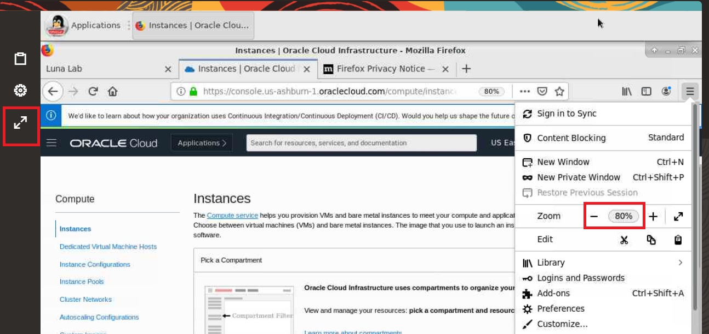
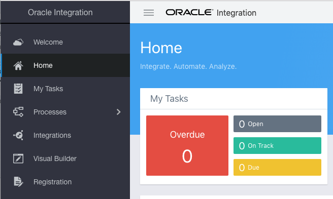
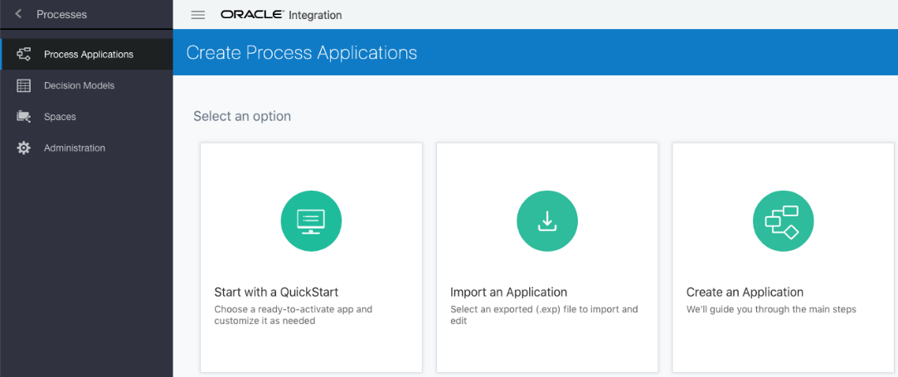
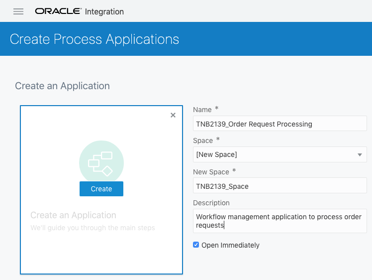
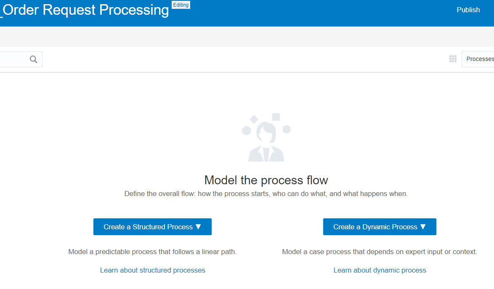
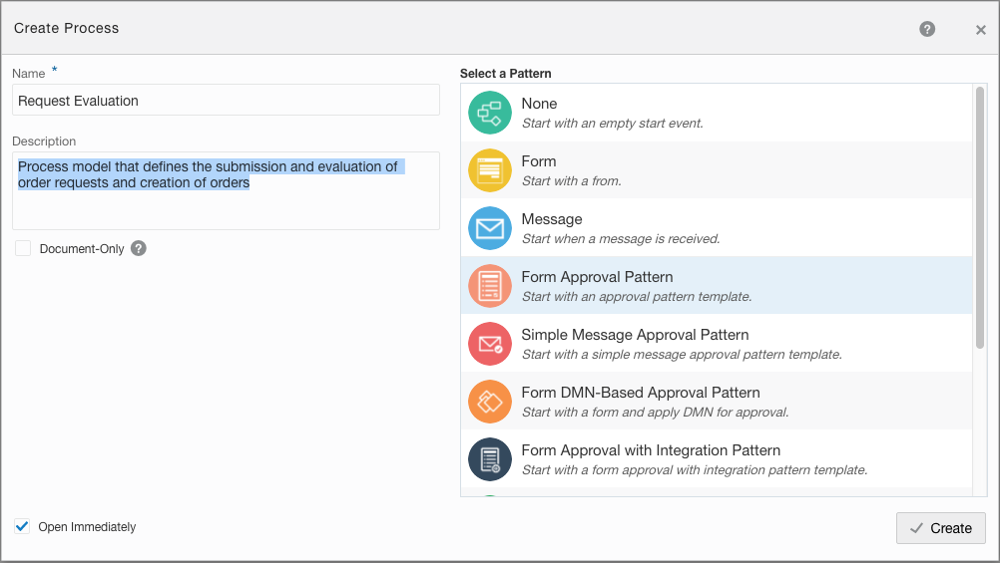
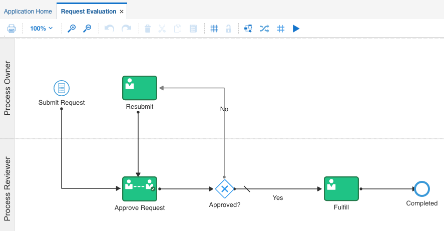
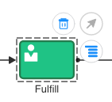
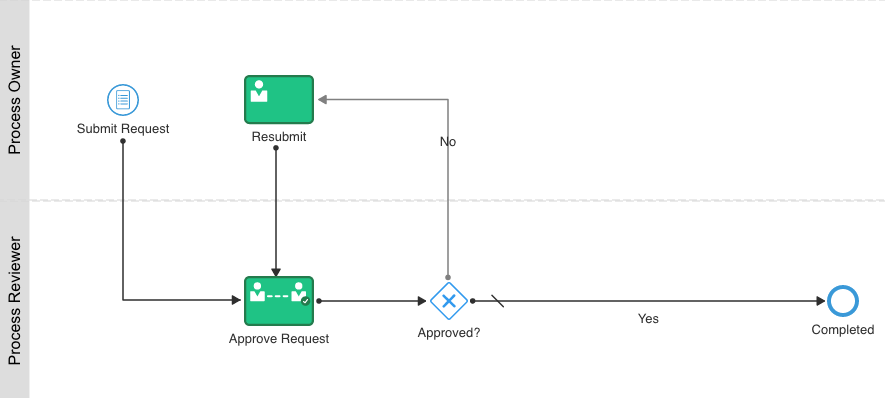

# Create Your Oracle Integration (OIC) Instance

## Introduction

****Walkthrough Demo Video****
[](https://videohub.oracle.com/media/Create+OIC+Instance+in+Luna/1_lfsoypih)


**Estimated Time**: 20 minutes


## Task 1: Create Your Oracle Integration (OIC) Instance

Here you will find the login tenant information required for this lab.  Now click on the ****OCI CONSOLE**** button to logon.


3. Back to the ****Luna Lab**** tab on top of your browser and copy and paste the credentials (username and password) to the login page.


4. Now you are on OCI mainpage. Click the hamburger icon at the top left corner. Select **Developer Services** on the left menu, then ****Integration****. 


5. Select your assigned compartment in the compartment dropdown menu that shows under ****Luna-Labs**** directory.  Then click on ****Create**** button on the right to create an OIC instance.


6. The ****Create Integration Instance**** window displays.  In ****Display Name**** field, give a name to your OIC instance.  Edition is ****Enterprise****, License Type is ****Subscribe to a new Oracle Integration license****.  Then click ****Create**** at the bottom of the form.


7. It takes around 10-15 minutes for a new OIC instance to be created for you.  Once it is done, the state will be changed from ****creating**** to ****active**** and you will be able to see a green dot.


8. Click on your instance link under Display Name.  Click the ****Service Console**** to activate the OIC instance. 


9. Now you are at Oracle Integration Cloud mainpage. Click the hamburger icon at the top right of Chrome browser to zoom out to 67-80% to optimize your viewing experience.



That completes the steps to prepare your environment and you are ready to start creating a process application in OIC environment. 

10. On the ****Integration Home Page****, select the ****Processes**** menu option at the left.



11. Click the ****Process Applications**** menu option at the left to display the ****Process Applications**** page which lists all applications that have been created in your Oracle Integration instance.

## Task 2: Create a Process Application

****Walkthrough Demo Video****
[](https://videohub.oracle.com/media/Process+Lab+-+Model+a+business+process/1_wlraznng)

We want to model a business process by creating a process application.

1. Create a new process application based upon an available style. Click on the ****Create**** button in the upper-right corner to display the ****Create Process Applications**** page:



2. Click on the ****Create an Application**** icon at the right to display the ****Create an Application**** prompt.

3. Fill in the basic information for your new process application:
    
      - Name: ****Order Request Processing**** 
    
      - ****Space: \[New Space\]**** A space is an area that you use to group applications together. All users who are members of a space have access to the applications in that space. By granting access to a space, you can share with other team members.
    
      - New Space: ****\<insertYourInitialsHere\>\_Space**** (****TNB\_Space****,for example)
    
      - Description: 
      ```
      Workflow management application to process order requests
      ```
      - Make sure that the ****Open Immediately**** field is checked on so the tooling will take us right into process creation after the process application has been created.
    
      - Click the ****Create**** button at the left:



4. Wait a moment and the ****Create a Process**** panel appears:



## Task 3: Add a Process

Our process application needs a process to run. Let’s create a new process that will contain the business logic to automate order request processing:
    
1. Click on ****Create a Structured Process**** button at the left and choose the ****Start with a form approval**** from the drop down menu so that we don’t start with a blank model. Just as the Integration tooling had ****styles**** to preconfigure artifacts and save you time, the Process tooling has ****patterns available for our choosing****. The Form Approval pattern fits our needs well. The ****Create Process**** dialog appears.
    
2. In the Create Process dialog, fill in the fields:
        
- Name: 
```
Request Evaluation
```
        
- Description: 
```
Process model that defines the submission and evaluation of order requests and creation of orders
```
        
- For ****Document-Only****, leave the default (unchecked) as is.
        
- With ****Form Approval Pattern**** selected at the right, click the ****Create**** button in the lower-right corner to create the new process:



The process model displays containing elements from the ****Form Approval**** pattern. This minimizes the amount of dragging and dropping you need to do to place elements from the palette onto the modelling canvas. ****NOTE:**** Your screen may show a more colorful process model, but the functionality is just the same.



3. Remove the ****Fulfill**** human activity from the model by clicking on it and selecting the ****trash can icon****. If nothing happens when you click the trash can icon, click on another element and then try again. Later, in place of the ****Fulfill**** human activity, we will include an invocation of an OIC integration namely ****Create New Order****:



4. Click ****Save**** to safely store away your new process.

5. Here is the starting point for our initial model implementation efforts:



   **Congratulations!**  

## Learn More


## Acknowledgements

* **Author** - 
* **Contributors** -  
* **Last Updated By/Date** - 
