# Implement the Submit Request Event

## Task 1: Implement the Submit Request Event

With all three web forms in place, let's map them into the process flow and configure some settings. We start with ****Submit Request**** event so the store manager can initiate a new order request.

1. Click the ****Close**** button in the upper-right corner of the form editor page.  Click ****Order Request Processing****, then ****Request Evaluation**** to display the process flow again.

2. Click on the ****Submit Request**** event at the left-side of the model.

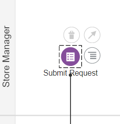

3. Click the ****hamburger menu icon**** that appears. If a popup menu doesn’t appear, click another element (like the Resubmit activity) to reset the selection and try clicking on the hamburger icon again to display the popup menu:


4. Select the ****Open Properties**** option in the popup menu. The properties display in the lower panel:

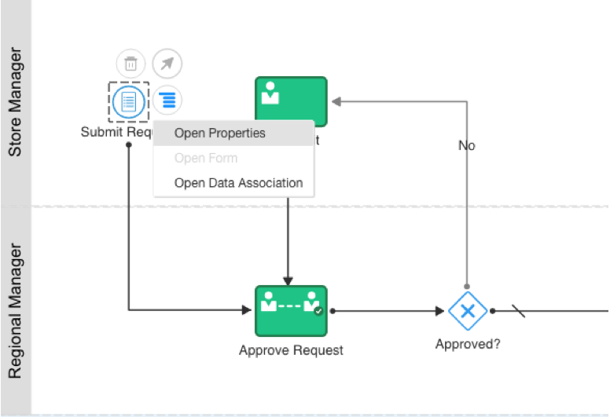

5. Provide the basic properties for the Submit Request event by filling in these fields:
    
      - How will the end user identify the process? Title: 
      ```
      Create New Order Request
      ```
    
      - Description: 
      ```
      Event that starts a new process instance and captures order request information from the store manager
      ```

6. In the ****Form**** area of the properties panel, click the magnifying glass icon to search for our previously created forms.

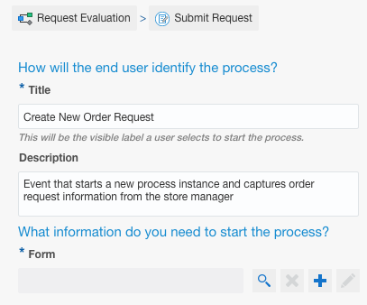


7. The ****Browser**** dialog appears and shows the ****FormMaster**** we created earlier. Click on it to select as the form we want to use.

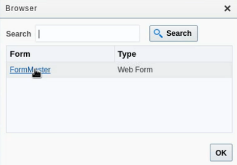

8. In the ****Form**** field, it shows ****FormMaster**** is added.  Also, it displays the ****Presentation**** field underneath.  Click on the drop-down and select ****InitiateForm**** which is the form view we created for store manager to submit requests.

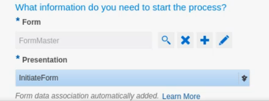

9. Click the little ****down arrow**** on the right under BPMN palette to close the window and return to the process diagram.


## Task 2: Implement the Approve Request Activity

Let’s work on the Approve Request human activity so the regional manager can evaluate an order request:

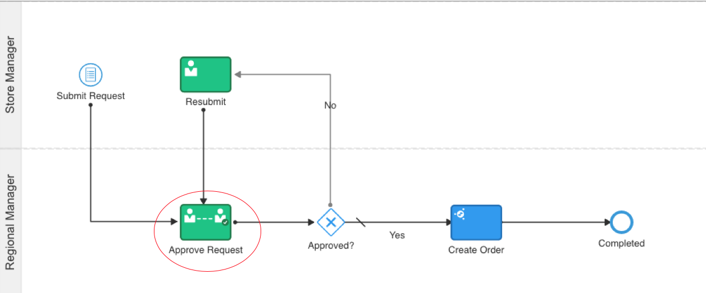


For each order request, the Regional Manager will approve it or reject it. Due to the type of human activity, the form will automatically display APPROVE and REJECT buttons at runtime:
    
1. Click on the ****Approve Request**** human activity at the left-side of the process model.
    
2. Click the hamburger icon that appears. If a popup menu doesn’t appear, click another element (like the Resubmit activity) to reset the selection and try clicking on the hamburger icon again to display the popup menu.
    
3. Select the ****Open Properties**** option in the popup menu. The properties display in the lower panel.
    
4. In the ****Title**** field at the right, enter: 
```
Order Request Needing Evaluation
```
This will make the task clear to the Regional Manager when it is dispatched to them.
    
5. In the associated ****Task Summary**** field, enter:
```
This is an order request from a store manager that needs evaluation.
```
6. In the ****Form**** field, click the magnifying glass icon to search for our previously created forms.
    
7. The ****Browser**** dialog appears and shows the ****FormMaster**** we created earlier. Click on it to select as the form we want to use.

8. In the ****Presentation**** field underneath.  Click on the drop-down and select ****EvaluateForm**** this time.  It is the form view we created for Regional Manager to approve or reject requests and leave comments in the evaluator comment field.
        
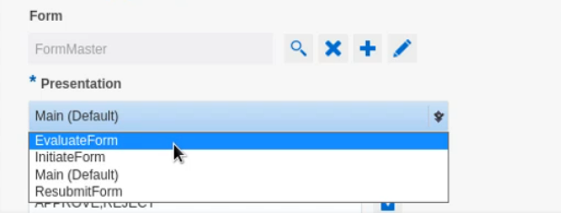         

9. Click the little ****down arrow**** on the right under BPMN palette to close the window.

## Task 3: Implement the Resubmit Activity

Let’s work on the Resubmit human activity next:

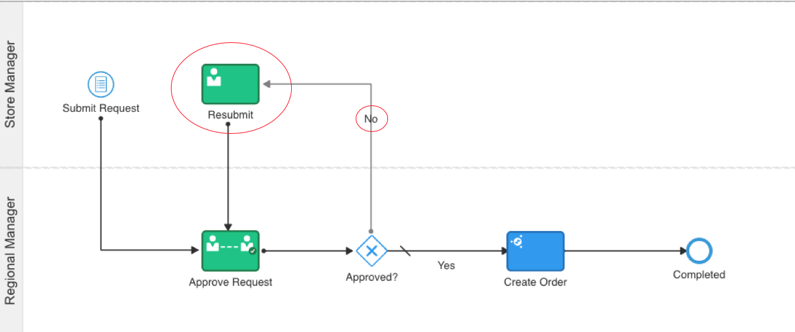


Recall that the Resubmit human activity allows the store manager to review a rejected request, edit it and resubmit it:
    
1. Click on the ****Resubmit**** activity in the process model.
    
2. Click the ****hamburger icon**** that appears. Again, if a popup menu doesn’t appear, click another element (like the Approve Request activity) to reset the selection and try clicking on the hamburger icon again to display the popup menu.
    
3. Select the ****Open Properties**** option in the popup menu. The properties display in the lower panel.
    
4. In the ****Title**** field at the right, enter:
```
Order Request Needing Reconsideration
```
This will make the task clear to the Store Manager when a resubmit task is dispatched to them.
    
5. In the associated ****Task Summary**** field, enter:
```
This is an order request that has been evaluated by a regional manager. It needs additional justification.
```
6. In the ****Form**** field, click the magnifying glass icon to search for our previously created forms.
    
7. The ****Browser**** dialog appears and shows the ****FormMaster**** we created earlier. Click on it to select as the form we want to use.

8. In the ****Presentation**** field underneath.  Click on the drop-down and select ****ResubmitForm**** this time.  It is the form view we created for Regional Manager to approve or reject requests and leave comments in the evaluator comment field.
        
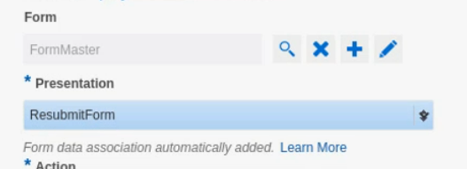         

9. Click the little ****down arrow**** on the right under BPMN palette to close the window.

10. Click ****Save**** in the upper right corner to complete this task.


****NOTES****
Form data (e.g. Order ID, stock ID, quantity requested etc) needs to be passed along from form to form as the process moves from activity to activity. Generally, we need to configure the data associations for each of our form-related activities like Submit Request, Approve Request and Resubmit activities to ensure the data fields are correctly mapped. However, OIC Form's presentation feature saves us time by completing these data association activities automaticially for us using Data Objects.  If you are interested to get a feel of what OIC has done for us, click on a specific form-related activity e.g. the Approve Request event. Click the ****hamburger menu icon**** and select the ****Open Data Association**** option to display the data mapper. Expand the data structures in the source panel (left-side) and target panel (right-side) to expose all the data stored in the forms and data objects.

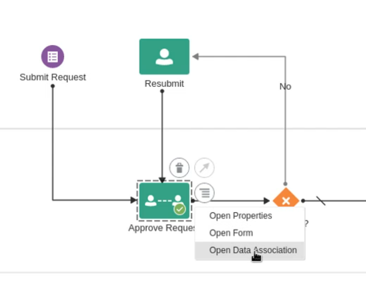 

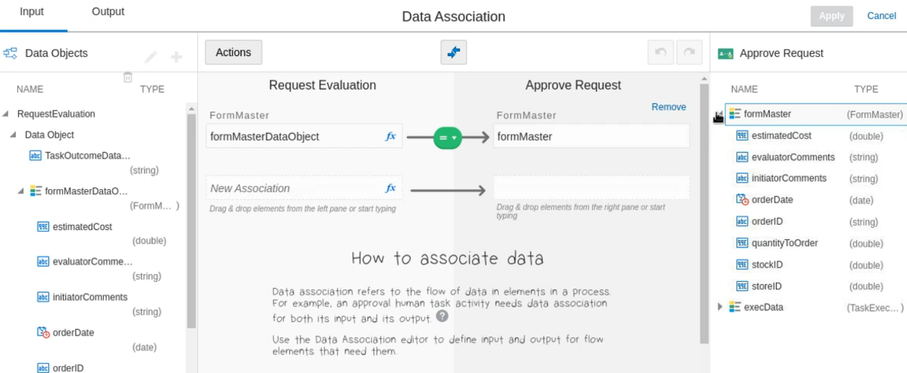

   **Congratulations!**  

## Learn More


## Acknowledgements

* **Author** - 
* **Contributors** -  
* **Last Updated By/Date** - 
