# Publish

## Task 1: Publish an Application

Your application is finished so you can now publish it. That gets us one step closer to being able to test it.

1. Click the ****Save**** button just to be sure everything is saved away.

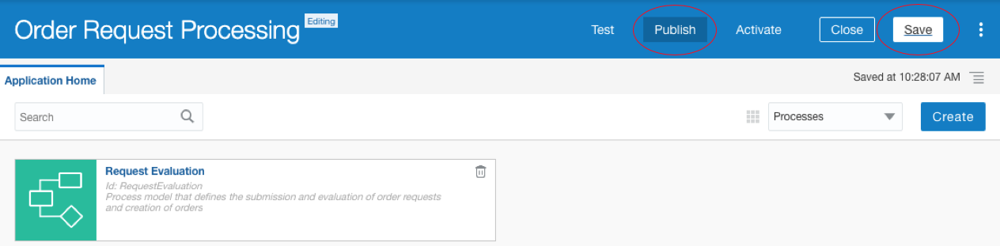


2. Click the ****Publish**** button at the top of the window.

3. In the ****Publish Application dialog**** that pops up, enter an explanation in the Comments fields: 
```
This version is the first publication of this process application.
```

4. Click the ****Publish**** button in the lower-right corner. ****NOTE:**** Your ****Publish Application**** may show a different list of unpublished changes:

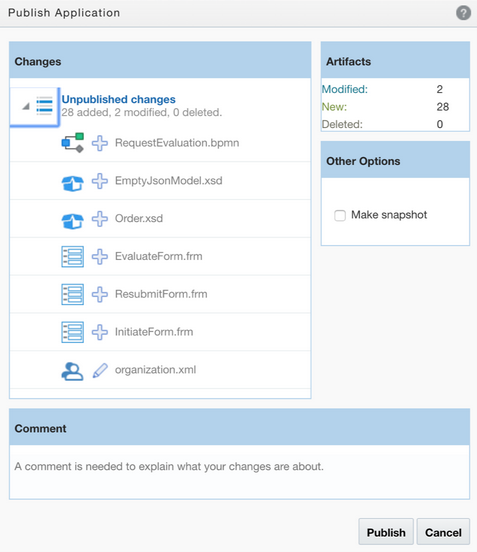

5. There is no feedback when the publishing is done. However, wait about 15 seconds before proceeding.

## Task 2: Activate an Application

After you publish, you need to activate your process application so it is available for use:

1. Click on the ****Test**** option at the top right of the window. A green message ****Current Application validation was successful**** should appear. 

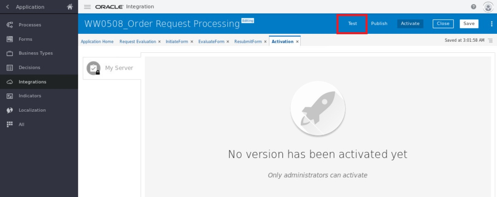

2. Click the ****Activate**** button in the ****blue box****. 


A pop-up window appears.  Make sure the ****Add me to All Roles**** box is checked.


3. Click ****Activate****. You should then see a little pop-up saying ****Application Activated Successfully****.  Your process application is now ready for testing.


## Task 3: Test an Application

****Walkthrough Demo Video****

[](https://videohub.oracle.com/media/Process+Lab+-+Test+a+Process+App/1_33qm23pl)

Let’s now perform an end-to-end test of your application by assuming the ****Store Manager**** and ****Regional Manager**** roles. We’ll use the same application interface that end users at Mama Maggy will use to initiate processes and accomplish tasks:

1. Click ****Test**** at top of screen, then click ****Try in Test Mode**** button at the bottom.


You should then be able to find your process application under ****My Apps**** tab. And the ****Testing Mode**** is ****On**** as shown under My Apps.

****Initiate a Request as a Store Manager****

Initiate your Order Request Processing application:
    
2. Click on your process application.


- Notice that your ****InitiateRequest**** form displays for the store manager to enter an order request.

- Here is where we are at in our process model now that an instance of your Request Evaluation process has been created:

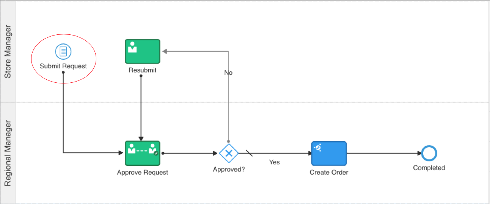

3. Submit a new order request as a store manager by entering the values in the web form that has appeared:
    
      - Order ID: ****\<insertYourInitialsHere\>\<insertCurrentTimeHere\>****

  NOTES:

  - The Order ID must be unique since ****orderID**** is the primary key of the ORDERS table in our ATP database.

  - The Order ID ****must not exceed 8 characters in length**** since that is the maximum length for the ****orderID**** column in the ORDERS table.

  - Your replacement for ****\<insertYourInitialsHere\>**** must be ****4 (or less) characters**** (**alpha or numeric**).

  - If it is 1:31 PM right now, use **1331** and if it is 9:38 AM, use **0938** for **\<insertCurrentTimeHere\>**. Your 4-character value combined with your **\<insertCurrentTimeHere\>** should provide a unique orderID.

  - For, example: ****TNB1105**** would probably be a valid ****orderID****.


  - Order Date: Select ****today’s date**** by clicking on the ****Select Date icon**** at the right of the field and picking it from the popup calendar.

  - Store ID: ****12****

  - Stock ID: ****177****

  - Quantity to Order: ****100****

  - Estimated Cost: ****$170.00****

  - Initiator Comments: 
  ```
  I need this fast or my customers will be unhappy.
  ```

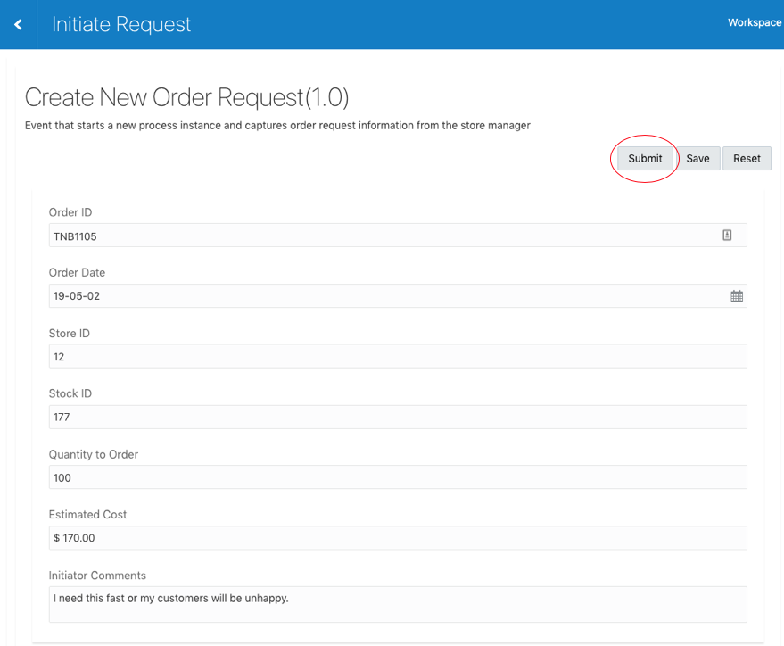

4. Click the ****Submit button**** (highlighted above) in the upper-right corner of the form to move the process instance along its way in the process flow. You are returned to the ****My Apps**** window.

Here is where we are in the process now as the application is waiting for the regional manager at the Approve Request activity:

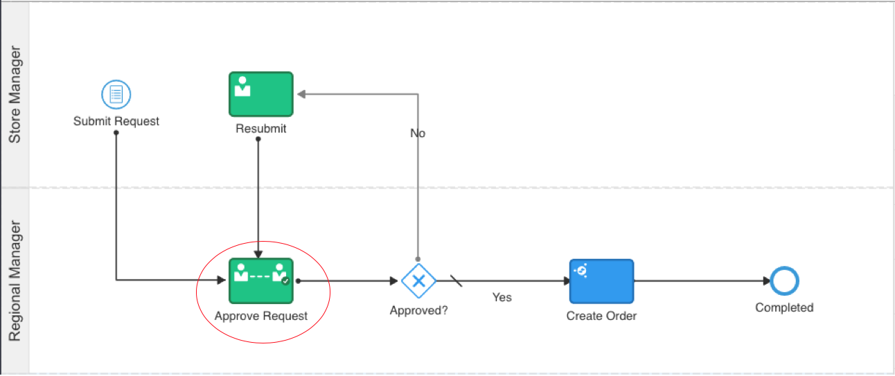


****Work a Task As a Regional Manager****

Recall that you also designed a form (****EvaluateForm****) for this Approve Request human activity. Use it now, as a regional manager, to reject the new order request:
     
5. Click the ****My Tasks**** option on the left menu.
     
See that, since you are also in the Regional Manager role, a task appears for you that requires your evaluation:

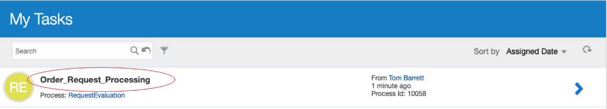

6. Click on blue arrow to the right of the task.

Your Evaluate Form appears with the store manager’s data already filled in thanks to the data associations that were mapped. Notice that the ****Initiator Comments**** field is greyed out now since you disabled it in the form designer to prevent the regional manager from modifying its contents.

7. In the ****Evaluator Comments**** field, enter the bad news: 
```
Alice at Store \#19 across town has a huge inventory of this item. Go get some of her extras.
```

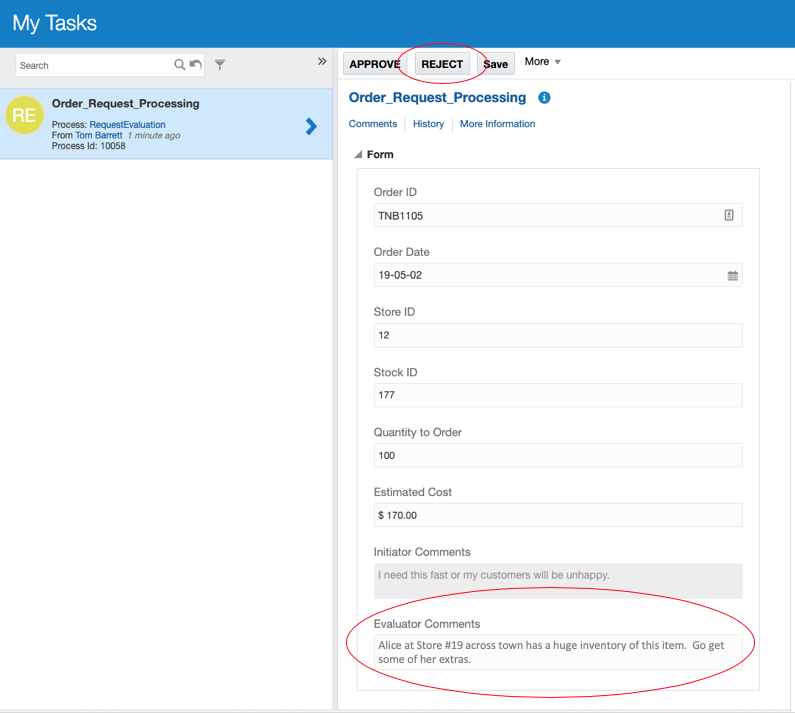

8. Click the ****REJECT button**** at the top of the form to send this order request back to the store manager who submitted it. Thanks to the data associations you performed, by clicking the REJECT button, the ****TaskOutcomeDataObject**** is set to ****REJECT****.

Let's review where we are in the process instance now. The execution passed through the ****Approved****? exclusive gateway and the workflow engine noticed that your condition for the ****No**** branch evaluated to ****true**** (TaskOutcomeDataObject="REJECT"). So, the process instance followed the ****No**** flow. Your application is now waiting at the Resubmit activity for the store manager to revisit their order request:

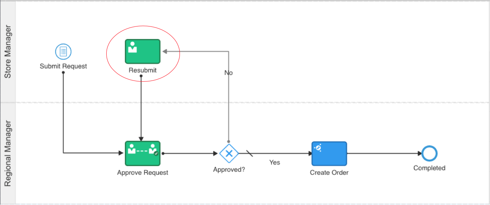


****Work a Task As a Store Manager****

9. Put your store manager’s hat back on and review tasks that have been assigned to you in the Workspace by clicking on the ****Refresh**** icon (circular arrow) in the upper-right corner of the ****My Tasks**** window:

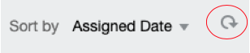


10. A task displays. That’s for the request that the regional manager just rejected. As a store manager, you have some work to do on it to plead your case. Click on the task.

The ResubmitForm you built for the Resubmit activity displays with the original store request data displayed along with the Evaluator Comments just supplied by the regional manager. Again, you are seeing data association mappings at work to populate these form fields. Notice this time that the ****Evaluator Comments**** are greyed out since you disabled this field so the store manager can’t change them.

11. ****Append the following comment to the end of the text**** that already appears in the ****Initiator Comments**** field: 
```
I checked with Alice. She doesn’t have any extras. I need this order to be place and fulfilled quickly.
```

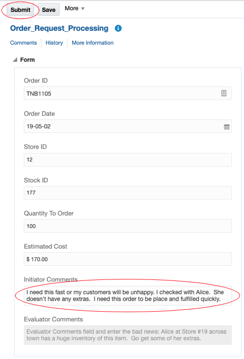


12. Click the ****Submit**** button (highlighted above) to send the request back to the regional manager that rejected it last time.

Here is where we are in the process now. The application is waiting at the Approve Request activity for the regional manager to pick up tasks in the workspace and move the process instance further in the flow:


****Work Another Task As a Regional Manager****

13. Put your regional manager’s hat back on and review tasks that have been assigned to you in the ****Workspace**** by clicking on the ****Refresh icon**** (circular arrow) in the upper-right corner of the ****My Tasks**** window:


14. A task displays. This involves re-evaluating the request resubmission from the store manager. Click on the task.

Thanks to your data associations, the form displays with all the fields prepopulated:

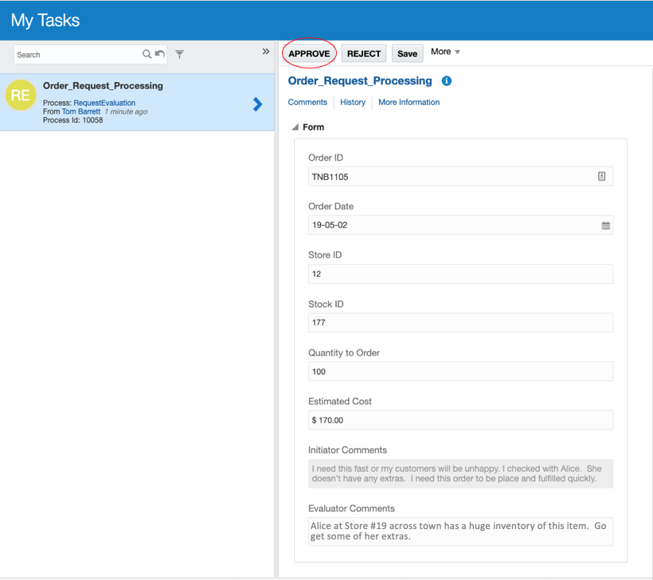

15. You read the additional ****Initiator Comments**** and sympathize with the store manager. There is no need to add anything to the ****Evaluator Comments**** since the additions to the ****Initiator Comments**** have convinced you that the order request is justified after all. So, just ****click the APPROVE button**** at the top of the form.

16. Again, click the ****Refresh icon**** in the upper-right corner of the My Tasks window to see that there are no new tasks in either role to process.

Here is where we are in the process now. The ****Approve?**** exclusive gateway took the default path since your ****No**** condition (TaskOutcomeDataObject="REJECT") evaluated to ****false**** because the regional manager clicked the APPROVE button this time. Execution proceeded to the ****Create Order**** integration activity where your Lab 1 integration was executed to add a new order to the ORDERS table in the ATP database. Then, the process instance finished by reaching the ****Completed**** end event:

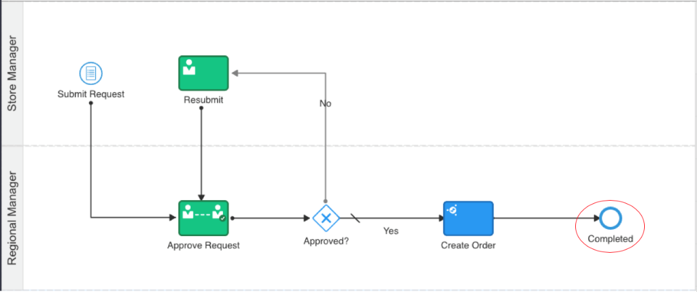 


## Task 4: Check Tracking for an Integration

Let’s check to see if the new order really got created in the backend system (the ATP database). In other words, did your Create Order integration (from Lab 1) do its job? Let's explore what we can learn from the **Tracking** facility:
     
1. Click on the ****House icon**** at the top of the menu at the left to reach the ****Home**** page.
     
2. Click on the ****Monitoring**** option in the menu at the left to display the ****Monitoring**** menu.
     
3. Click on the ****Integrations**** option on the menu at the left.
     
4. Click on the ****Tracking**** option in the menu at the left to display the ****Track Instances**** page.
     
5. Find your integration in the list and see that its status shows ****Succeeded****.

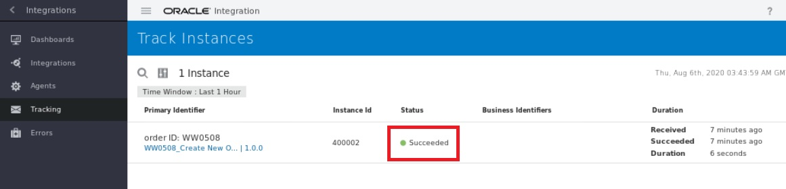


## Task 5: Check the ATP Database Table

The tracking evidence looks compelling so far. Now, let’s see if the row was really added to the ORDERS table. Let's use Oracle SQL Developer to look into the ORDERS table in the ATP database:

****Configure SQL Developer Database Access**** 

-  SQL Developer will be used to access the ATP database to see if a new approved order has been added to the “Orders” table in the database. To establish access to your ATP database from your SQL Developer, we need to configure SQL Developer in advance.  Let's do it now:
   
- Minimize your Google Chrome screen and find SQL Developer icon at the Luna's Desktop.  
     
- Start Oracle SQL Developer by clicking its icon. This has been pre-installed for you.
    
**Create a new connection:**
        
1. Click the ****File**** menu bar option and click the ****New**** option. The ****New Gallery**** dialog appears.
        
2. Double-click the ****Database Connection**** option at the right. The ****New / Select Database Connection**** dialog appears. Fill in the following fields:

- Name:
```
MyATPConnection
```
        
- Username: 
```
atpc_user
```
        
- Password: enter
```
DBWelcome12345
```
        
3. Click on the ****Save Password**** field so you aren’t prompted for the atpc\_user password each time you activate your connection.
        
4. Connection Type: ****Cloud Wallet****
            
5. Configuration File: ****Browse**** to and open ****Downloads**** folder in the Luna File Manager to find your wallet zip file ****wallet_DBAPPINTSHARED(2)**** that you've just downloaded earlier.
            
6. Service: ****dbappintshared\_high**** option. Select it from the dropdown list. Note: ****dbappintshared**** is the name of the ATP instance that we will use for this lab to create orders in the database.  The ****high**** option gives us the best performance.
        
7. Click the ****Test**** button at the bottom to see if SQL Developer can connect to your ATP database as ****atpc\_user****.  Wait for a moment as access is attempted. Look for the “****Status: Success****” message that appears in the lower-left corner.
            
8. If the test fails, check that the ****Service**** is specified incorrectly.
            
- If the test still fails and you are in an Oracle class, you may need to configure the ****Proxy****:
                
  - Click on the ****Proxy**** tab.
                
  - Toggle on the ****Use SQL Developer Proxy**** radio button.

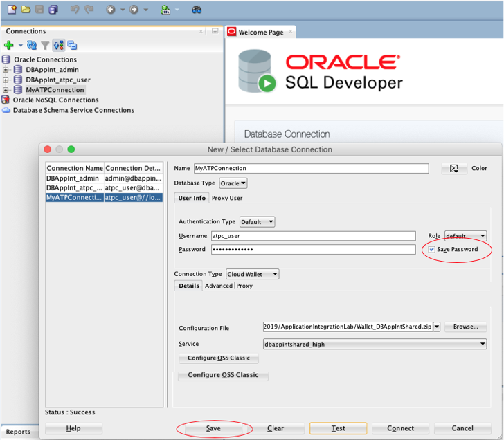

  - Once the test is successful, click the ****Save**** button at the bottom of the dialog.

  - Click the ****Cancel**** button at the bottom to exit the dialog.


****Check Your Order****

9. ****Double-click**** on your ****MyATPConnection**** in the Connections panel at the left to open a connection to the database. The connection should open automatically since you elected to save your ****atpc\_user**** password. If you are prompted for your password, enter it and proceed.

10. Expand the ****Tables (Filtered)**** hierarchy at the left.
  
11. Click on ****ORDERS**** to display your table in the panel at the right.
  
12. Click on the ****Data**** button at the top of the right-side panel and find your new order in the list of database rows. This verifies that the order has really been added to the ORDERS table in the ATP database by your CreateOrder integration:

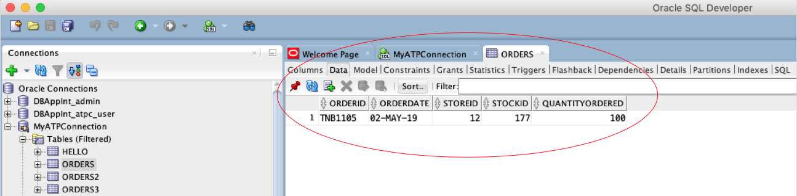

****Exit SQL Developer****
    
13. ****Right-click**** on your ****MyATPConnection**** in the Connections panel at the left to display a popup menu.
    
14. Select the ****Disconnect**** option.


****Congratulations! This completes all lab exercises.****

> There is a further lab training opportunity for you to learn about the **business analytics** feature of Oracle Integration via another hands-on lab using the same Mama Maggy use case.  Search for ****Oracle Integration (Insight)**** to check out the details.    

## Learn More


## Acknowledgements

* **Author** - 
* **Contributors** -  
* **Last Updated By/Date** - 
