# Tailor Roles


## Task 1: Tailor Roles for Each Process Swimlane

Tailor the roles to correspond to our Mama Maggy use case. The default roles in OIC for this pattern are ****Process Owner**** and ****Process Reviewer****. They form two horizontal responsibility lanes called “swimlanes” across the model by members of the associated role. We’ll rename the roles to ****Store Manager**** and ****Regional Manager**** so that they match our Mama Maggy use case.
    
1. Find the labeled roles at the left.
    
2. Click on the ****Process Owner**** label in the top swimlane.
    
3. Click on the ****Edit**** (pencil) option that appears.
    
4. In the bottom panel, click on the ****plus icon**** to the right of the ****Role**** dropdown menu to add a new role.
    
5. In the ****Create Role**** popup dialog, enter ****Store Manager**** as the role name and click on ****OK****.
      
6. Collapse the bottom panel by clicking a small arrow on the right
    
7. Repeat the above steps for the ****Process Reviewer**** swimlane to create a new role called ****Regional Manager****.

Your new roles, displayed at the left, now properly identify role responsibilities. Store Managers execute Submit Request and Resubmit while Regional Managers execute Approve Request:

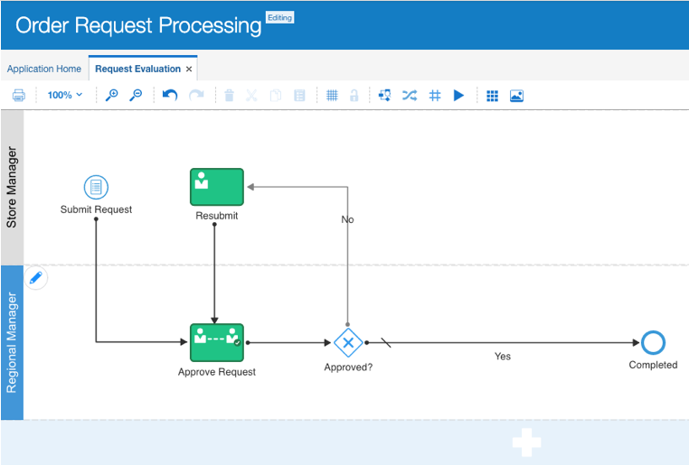

8. Click the ****Save**** button to safely store away your updates.


## Task 2: Create Web Forms

To enable store managers to submit an order request and regional managers to approve or reject the requests, we need to create THREE web forms for them to fill in and evaluate during the order request process as shown in the process diagram.  OIC has an easy form building tool that helps users to develop and customise forms quickly based on their needs. 
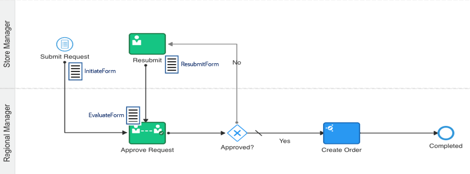

1. Select ****Forms**** from the navigation pane on the left, click ****Create a Form**** button in the middle on the screen.

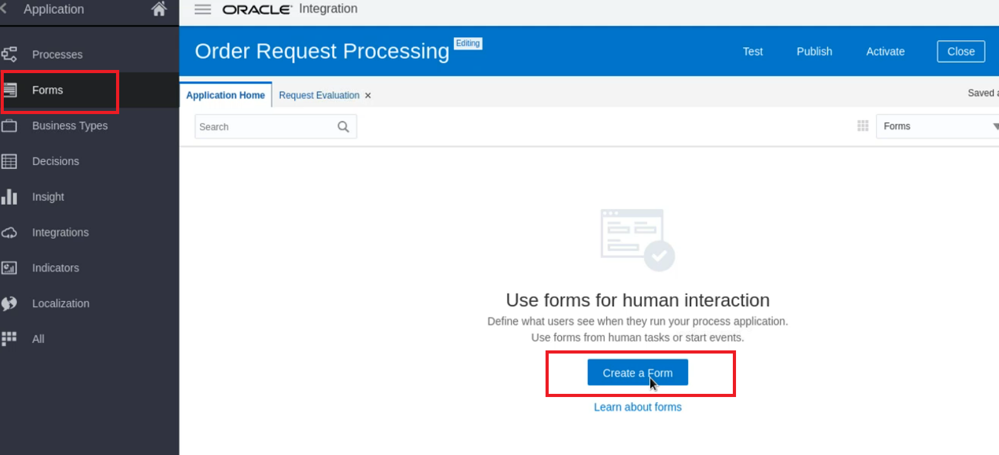

The ****Create New Web Form**** dialog appears.  Our plan is to create a master form first, so we can use it to customise for other forms to save time.

2. Enter the following: 
  - Name: 
  ```
  FormMaster
  ```
Then click ****Create**** button to establish the new form.

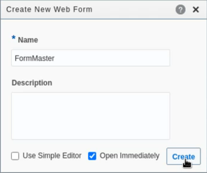

3. Define the layout of the master form:
            
      - Notice the palette at the right containing the elements that you can add to a web form:

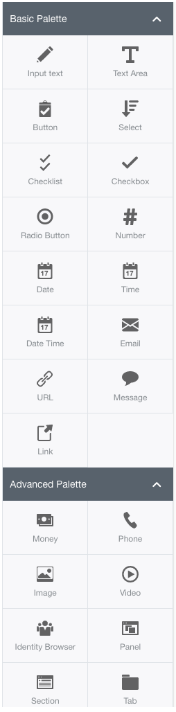

4. Drag an ****Input text**** element from the palette and drop it on the canvas in the middle of the form editor page.

5. Click on your new ****InputText**** element and see the ****Properties**** panel at the left showing its definition details:

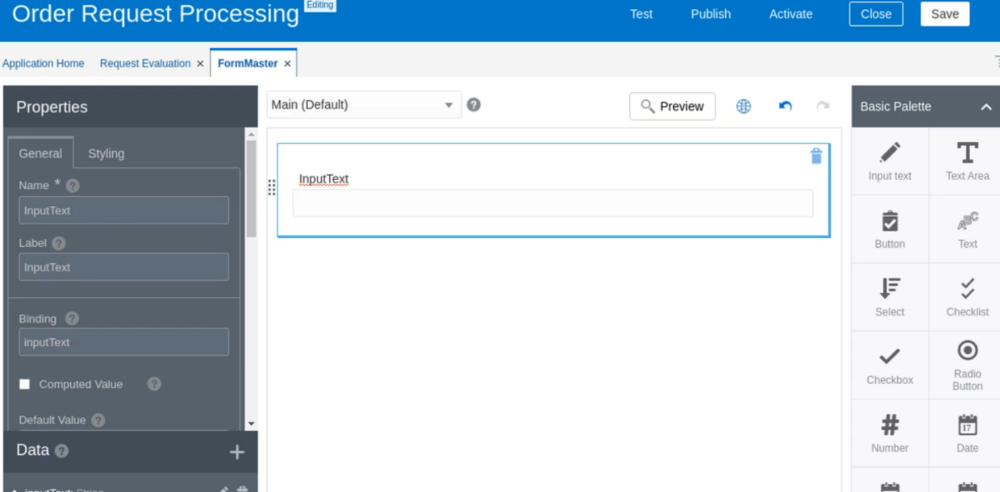

6. In the ****Properties**** panel, edit the properties for this field element. Press ****Return**** after each entry:
    
      - Name: ```orderID``` (This is the internal field name.)
    
      - Label: ```Order ID``` (This is how the field will be labelled for the end user.)

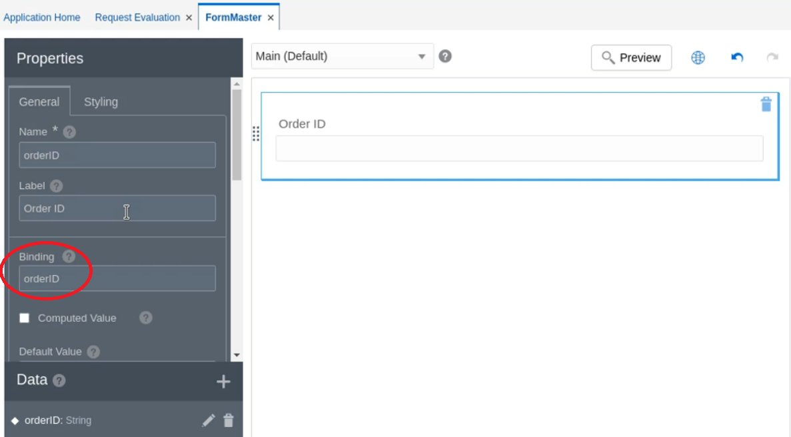

Notice that a ****Binding**** object has been identified where data will be stored for the form element. It is also named ****orderID****. Binding objects are data structures storing values users enter into a web form field. You will deal with these objects as you do data associations later.


7. Using the steps above, add the other elements to the form:

| ****Palette Element Type**** | ****Name****            | ****Label****            |
| ------------------------ | ------------------- | -------------------- |
| Date                     | **orderDate**         | **Order Date**         |
| Number                   | **storeID**           | **Store ID**           |
| Number                   | **stockID**           | **Stock ID**           |
| Number                   | **quantityToOrder**   | **Quantity to Order**  |
| Money                    | **estimatedCost**     | **Estimated Cost**     |
| Text Area                | **initiatorComments** | **Initiator Comments** |
| Text Area                | **evaluatorComments** | **Evaluator Comments** |


8. Click the ****Save**** button in the upper-right corner of the form editor page.

**Tip**: Before you leave for ****Form Designer****, click on the ****Preview**** button at the top. In the ****Preview**** window that appears, you can explore exactly how your form will display on a variety of different sized devices. When done exploring, click the ****X**** in the upper-right corner to exit the ****Preview**** window.

Now we move on to customise an order initiate form for Store Managers to submit their requests based on the master form we have just created. Here is the form will be positioned in the process. 
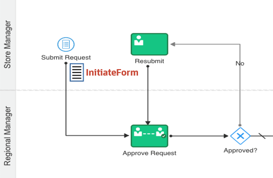

We use the ****Presentation**** feature that allows us to customize the views of the same form to different users, i.e. store managers and regional manager in our use case.

9. Click any blank area under Evaluator Comments field.  On the ****Properties**** pane, find ****Presentation**** and click ****+****. The ****Select Presentation Type**** dialog box then appears. Since we created a master form earlier, we would like to use its presentation to customize different views, so we choose ****Clone**** option in the middle of the menu, then click ****Select****.
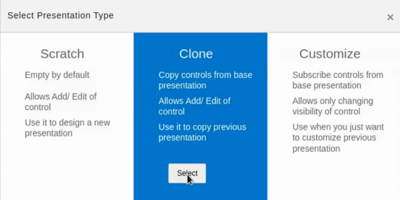

10. The ****Create Presentation**** dialog pops up.  Enter the following:
  - Name: 
  ```
  InitiateForm    
  ```
  - Description: 
  ```
  Form that a store manager uses to enter a new order request
  ```

Make sure the ****Switch to this presentation**** box is checked as default.  Then click ****Create****.

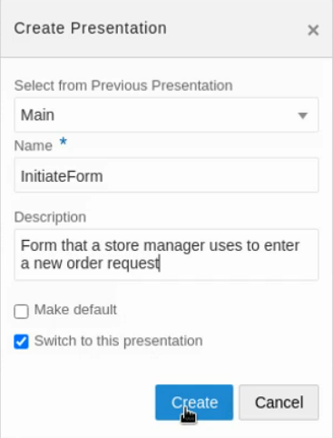

From the drop-down on the top of the form and the ****Presentation**** column on the left that show a new presentation view namely InitiateForm is established.  We can now customise the fields of this form view for Store Managers from here.

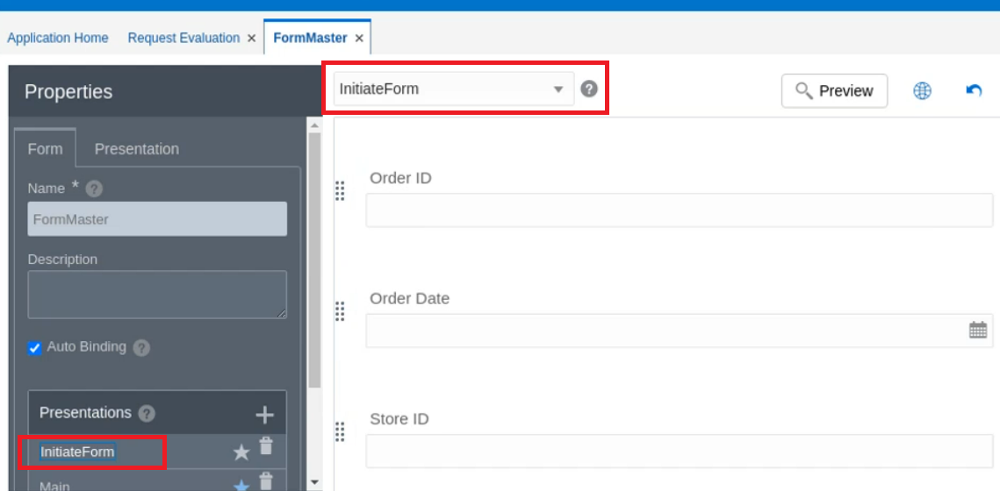

11. ****InitiateForm**** is the form to be used by Store Managers in the Submit step of the process. This form submission will trigger the start of the order evaluation process.  At this stage, the order evaluator (i.e. Regional Manager) is not involved yet.  So the ****Evaluator Comments**** field from the master form is not relevant for the InitiateForm.  We should remove/hide this field on this form to avoid any confusion created to the Store Managers.  Let's do this.  Scroll down the form to the bottom to find ****Evaluator Comments**** field. Click on it, then scroll down the ****Properties**** pane to find the ****Hide**** box and check it.
 
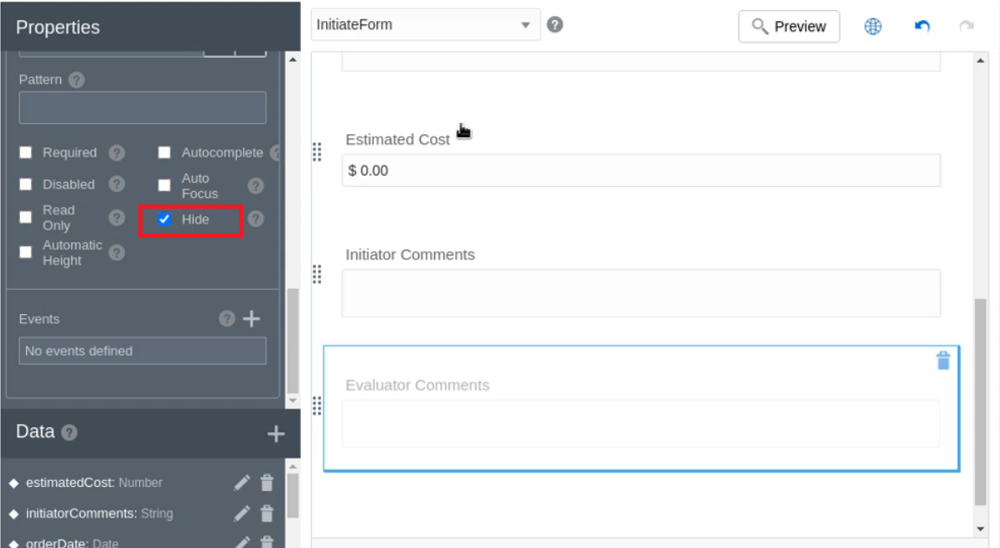

With this, evaluator comment field will not appear in the Initiate Form.  We are done with the first form creation.  Click ****Save**** to save the changes before moving on to create the second form.

12. Now we need to create the second form which is used by the Regional Manager to review the order request information provided by Store Managers and then make the approve/reject decision.  

Firstly, click any blank area under Evaluator Comments field to display the ****Form**** tab on the ****Properties**** pane on the left.  Then under ****Presentation****, click ****+****. The ****Select Presentation Type**** dialog box appears again. Choose ****Clone**** option, then click ****Select****.       

13. Enter the following at the ****Create Presentation**** dialog box:
  - Name: 
  ```
  EvaluateForm    
  ```
  - Description: 
  ```
  Form that a regional manager uses to either approve or reject an order request initiated by a store manager
  ```

Make sure the ****Switch to this presentation**** box is checked as default.

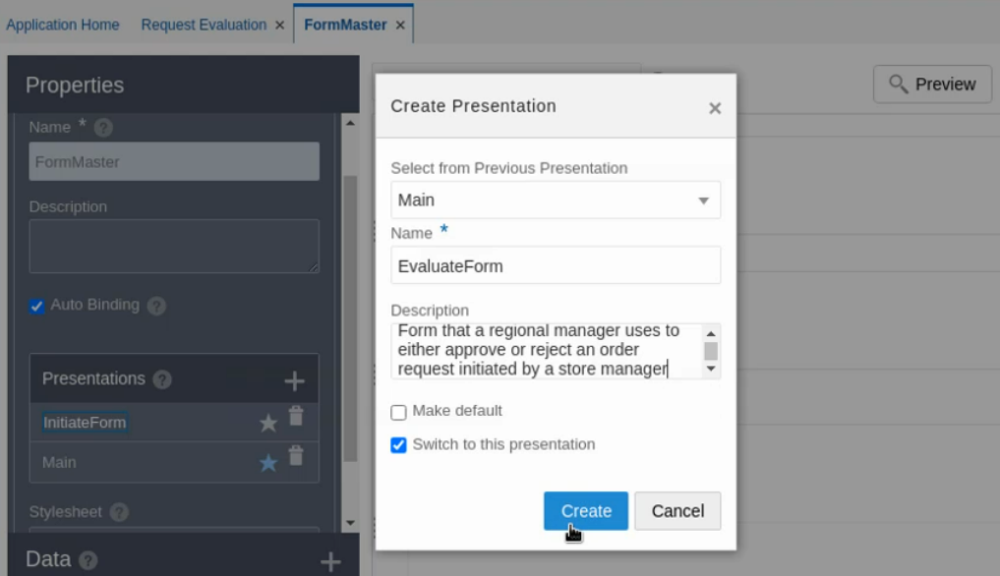

Click ****Create****, then ****EvaluateForm**** is established.

Scroll down the form to review the field list.  You find that all data fields are necessary for the evaluator (i.e. Regional Manager) to approve an order. It also includes the ****Evaluator Comments**** field where he/she can leave a message to the requestor.  However, we don’t want the regional manager to be able to change the comments entered by the store manager, so we need to disable update for the initiatorComments text area on this form.

14. Click on ****Initiator Comments**** field, check the ****Disabled**** box at the Properties pane on the left. The field data entry area turns grey. Click the ****Save**** button in the upper-right corner.
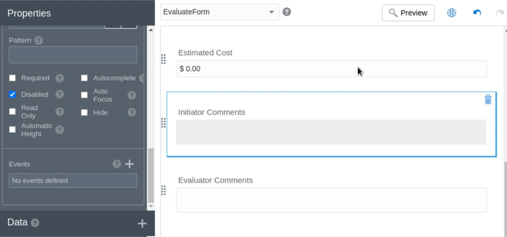

15. We move on to create the last form to be used by Store Managers to edit an order request and resubmit it for re-evaluation when the previous submission is rejected by Regional Manager.
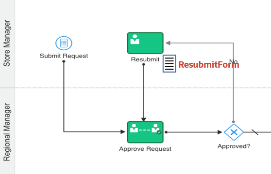 

Click any blank area under Evaluator Comments field to display the ****Form**** tab on the ****Properties**** pane on the left.  Then under ****Presentation****, click ****+****. The ****Select Presentation Type**** dialog box appears again. Choose ****Clone**** option, then click ****Select****.       

16. Enter the following at the ****Create Presentation**** dialog box:
  - Name: 
  ```
  ResubmitForm    
  ```
  - Description: 
  ```
  Form that a store manager uses to change an order request and resubmit it for reevaluation by a regional manager
  ```

Make sure the ****Switch to this presentation**** box is checked as default.

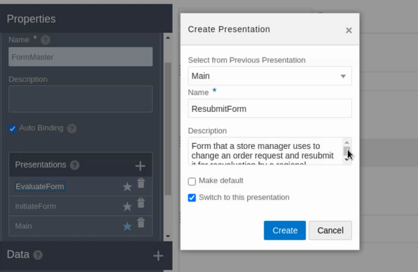

Click ****Create****, then ****ResubmitForm**** is established. 

17. We have no more field to add to the Resubmit Form but we don’t want the store managers to be able to change the comments from the regional manager evaluator, so we need to disable update for the evaluatorComments text area:

Click the ****Evaluator Comments**** element. Scroll the properties list to find the ****Disabled**** option and click it ****On****. The field is greyed out. Click the ****Save**** button.  We have completed creating all three forms for the process. 


   **Congratulations!**  

## Learn More


## Acknowledgements

* **Author** - 
* **Contributors** -  Aditya Duvuri, Rohit Saha
* **Last Updated By/Date** - Theodora Cristea, August 2021
